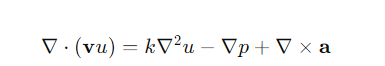
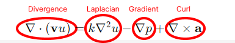
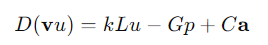
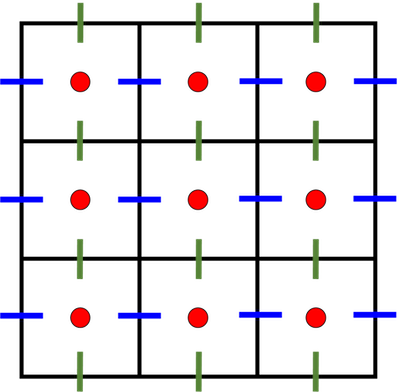
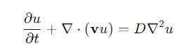
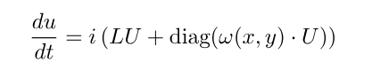
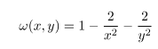
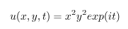

#  Intro to PDE solving and how to use MOLE.

##  What is a PDE and how to numerically solve it:

A PDE is a set of partial differential equations that are normally (but not limited to) discretization between latex( x,y,t)

The goal of numerical methods is to approximate solutions without the need to have an analytical solution.

How to solve differential equations numerically?

Numerical methods mainly rely on discretizing the continuous base variable (time or space) and using certain properties to approximate the function behavior at that variable.

ODEs mainly rely on time. In order to numerically solve an ODE we have to discretize time and solve using a numer8ical approximation scheme. (Forward Euler, Leapfrog, Runge-Kutta, etc)

**However, PDEs rely on space (and maybe time) depending on the equation.**

The mimetic operators are used to discretize the spatial part of the equation.

*(Future works are focused on the mimetic time discretization).*

If the equation is time-independent, that is all the numerical schemes you need to implement. We can transform the equation into a series of linear equations (i.e Matrix Form) using the known operators. And solve it!

If it is time-dependent, all we have to do is to apply the space discretization. After we have the space discretization we are left with an ODE, which can be solved with your favorite time scheme. (Depending on the chosen scheme, your mileage may vary, more on that later).

## So why use mimetics:

(Insert POSITIVES)

Once you have a good understanding of the equations, numerical methods and the MOLE library, implementing the code should be as easy as just calling functions like you would do in any other library.

## What are mimetic operators:

Basically, everything we learned in vector calculus. Divergence, gradient, curl, and Laplacian.

To maintain consistency, we will follow these notations for now (there will be additional terms and notations down the line, we will define them later for simplicity).

- Laplacian = L

- Gradient = G

- Curl = C

- Divergence = D

So now we have to identify the operators and replace them with the mimetic operators.

Now you are probably wondering what to do with scalars and functions that are not vector calculus operators.

Well if you remember from before, we are trying to transform these differential equations into matrix form to solve linear equations. Scalars in the differential equation can be treated as scalars in the same way in linear algebra. Time-independent functions (such as forcing or potential wells) also can be rewritten into matrix form by simply evaluating the function at the discretized points,

(Time dependant functions need to be updated at the global t and reused, however this is more complicated)

Check out the “made-up” PDE below. This PDE is not necessarily a physically accurate model, but we included all major vector calculus operators for the sake of demonstration.

First, we start with a time-independent PDE:

First step: identify the vector calculus operators.

 We can see that in this equation we have all of the D,V,C and L.

This is good now we can rewrite it into our predefined notation:

And there we have it! It is ready to go into the MOLE package… almost.

Here we introduce new terms and ideas.

### Interpolers and the staggered grid.

The idea of discretization in mimetics is to create a rectangular grid (or at least transformable to rectangular). And certain operations work on certain parts of the grid. This is a functional tutorial on how to solve PDEs using the MOLE library and mimetic concepts so I will not dive into the why. If you are interested in the theory, I refer you to the many works published in this field.

This is a staggered grid.

Let's define some other terms: we have the centers (in red dots) we have nodes (the intersection between lines) and we have the faces(the lines)

Understanding an equation and its mimetic formulation:

We are going to start off easy at first.

Let’s take (a relatively complicated example)  

## Now a real physical Equation

This is my personal favorite equation. The reformulated time-dependent 2D Schrödinger equation
%20u)

### Spatial Discretization
Just like before, we replace the vector calculus operator with our mimetic operators. 

Next step is to see where the calculation is happening. Since Laplacians are on the centers, data is on the centers and the diagonalized functions and scalars are on the centers, we don't need any interpolar functions, spatial discretization is done.
Also if you are wondering what *i* is, it's just a scalar! an imaginary number but it is still a scalar and MATLAB can handle the computations with ease.

### Time Discretization
Now it is time to solve for time. As you can see we are left with an ODE so any time discretization scheme *should* work.
Like always it is advised to use higher-order accuracy and energy-conserving numerical schemes. Empirically, RK4 did a good job simulating the model.

### Boundary Conditions
Imposing boundary conditions:
For this equation, we have a time-dependent Dirichlet boundary condition. After each time step that the equation is evaluated, we can impose boundary conditions. With the given initial conditions, we are ready to simulate.

### Equation parameters

We are using a time-independent potential function with this form:

In this case, the analytical solution is given by the following:

